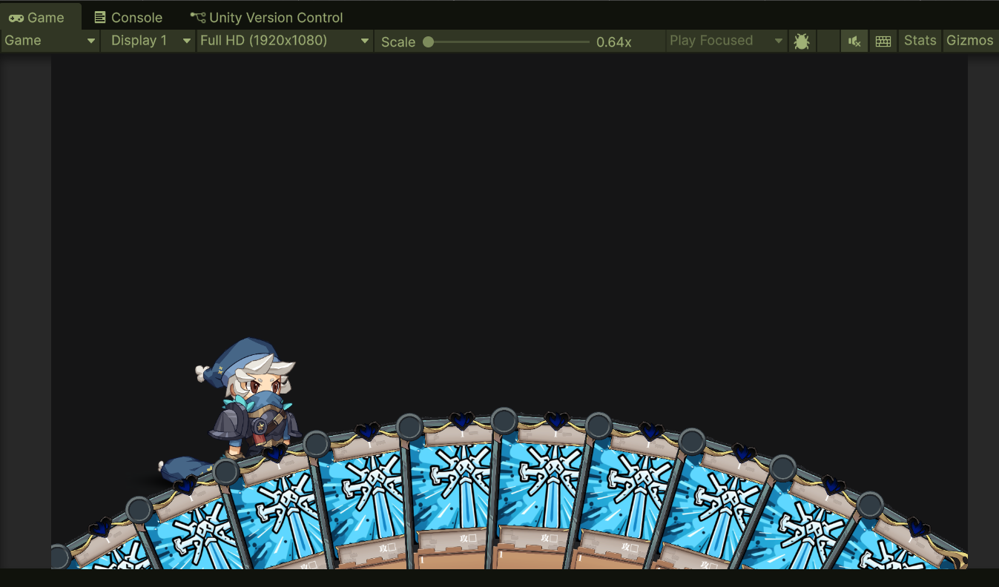

编辑器版本 Unity 6000.0.52f

本仓库用于个人开发记录和作品展示,无其他用途

开发日志(目前进度 60%)

5/11/2025 完成卡牌效果处理

3/11/2025 完成人物帧动画配置

2/11/2025 完成卡牌横向布局和扇形布局和指向箭头

31/10/2025 完成人物基类,卡牌基类,抽卡逻辑的编写

30/10/2025 完成地图所有逻辑

26/10/2025 初始化仓库
