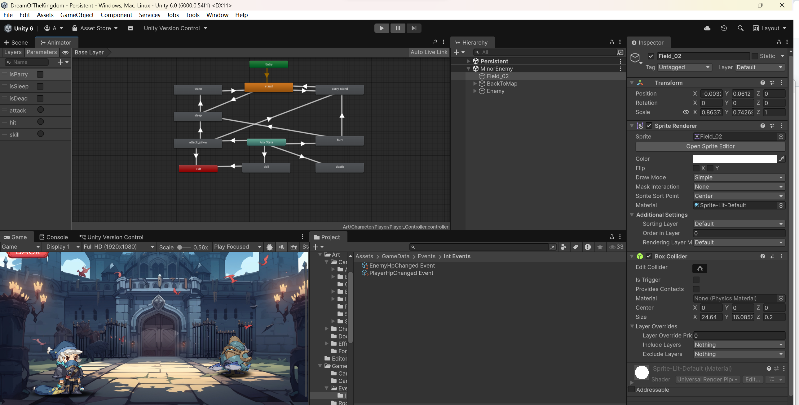
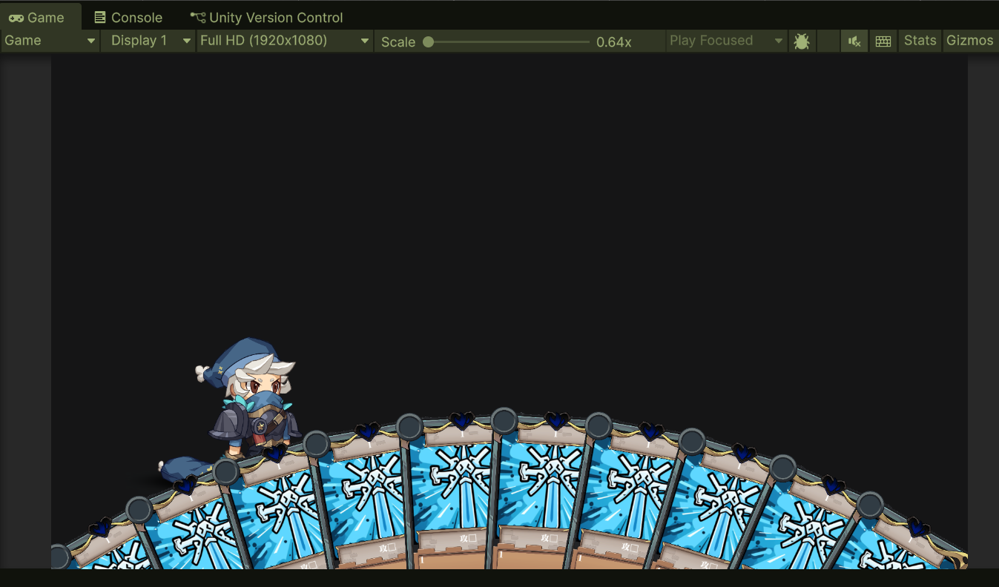
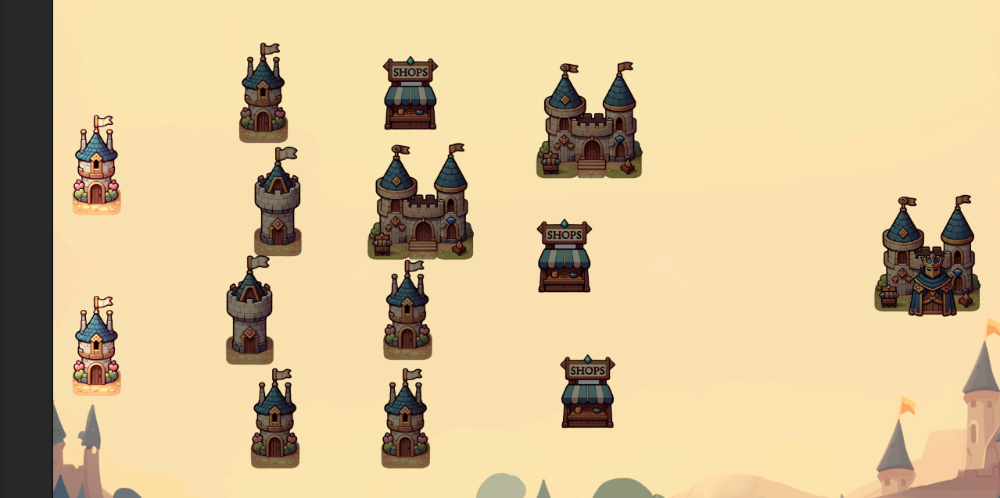

# Dream Of The Kingdom

编辑器版本：Unity 6000.0.52f

本仓库用于个人开发记录与作品展示。

## 项目简介
Dream Of The Kingdom 是一个卡牌与地图探索相结合的独立游戏原型项目，当前重点在于卡牌系统、角色动画配置与地图逻辑。

## 运行环境
- Unity 6000.0.52f
- Windows/macOS/Linux 均可（建议使用与项目一致的 Unity 版本）

## 快速开始
1. 使用 Unity Hub 选择 **Open** 并定位到本仓库目录。
2. 等待依赖与资源导入完成。
3. 在 `Assets/` 中找到主场景并打开运行（如存在多个场景，请以最新编辑的场景为准）。

## 项目结构（节选）
- `Assets/`：主要资源与脚本
- `ProjectSettings/`：Unity 项目配置
- `Packages/`：包依赖配置
- `image/`：开发日志截图

## 开发日志（目前进度 60%）
- 5/11/2025 完成卡牌效果处理
- 3/11/2025 完成人物帧动画配置

  

- 2/11/2025 完成卡牌横向布局、扇形布局和指向箭头

  

- 31/10/2025 完成人物基类、卡牌基类、抽卡逻辑编写
- 30/10/2025 完成地图所有逻辑

  

- 26/10/2025 初始化仓库
